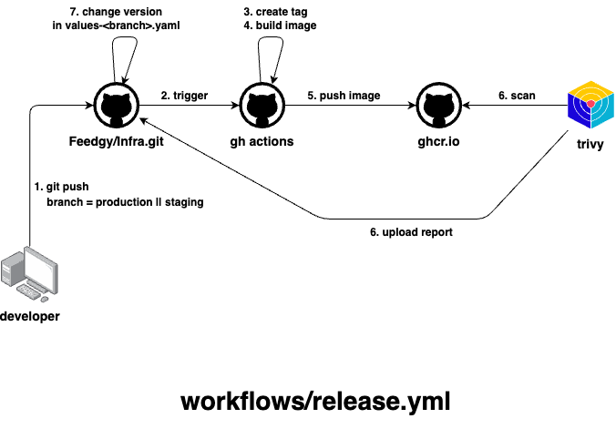

---
runme:
  id: 01JCGQD1DND3ZQ2QJSXS026NM7
  version: v3
---

# templates

Repository to group all workflow at the same place.

## release

The `.github/workflows/release.yml` releases a new version of a given application on production or staging environments.

